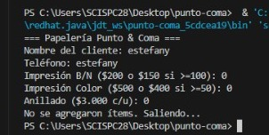

# Papelería “Punto & Coma”

En Punto & Coma, estudiantes e independientes hacen encargos de impresión y anillado para recoger el mismo día. El sistema registra nombre y teléfono del cliente y permite crear un pedido con ítems de este catálogo: Impresión B/N ($200 c/u, o $150 c/u si son 100 o más), Impresión Color ($500 c/u, o $400 c/u si son 50 o más), y Anillado ($3.000 c/u, sin precio por volumen). El cálculo funciona así: primero determinar subtotales por ítem aplicando precio por volumen cuando corresponda; luego sumar el total bruto; después aplicar un solo beneficio: si el pedido incluye al menos un anillado y la suma de impresiones (B/N + Color) es ≥ 30, se aplica 10% de descuento; de lo contrario, si el total bruto > $40.000, aplicar 5% de descuento; si ninguna condición se cumple, no hay descuento. No se aceptan cantidades ≤ 0. Tras confirmar el pedido, queda bloqueado y el sistema debe mostrar un resumen con detalle (precio aplicado por ítem), total bruto, descuento y total final. No se gestiona inventario ni pagos: solo el flujo de crear → calcular → confirmar → resumir.

# Analisis

## requqrimientos 
1. el programa debe registrar nombre y telefono del cliente
2. debe mostrar el catalogo de items
3. debe determinar subtotales por item y aplicar el precio por volumen cundo corresponda
4. calcular total bruto
5. aplicar beneficio que corresponda
6. calcular el total a pagar
7. no aceptar cantidades ≤ 0 
8. debe mostrar un resumen claro que tenga: precio aplicado por item, total bruto, descuento y total final

## criterios de aceptacion

1. al hacer el pedido calculo correctamente el precio por volumen
2. el pedido incluye anillado y la suma de impresiones es ≥ 30 el programa aplico 10% de descuento 
3. se ingreso el nombre y telefono del cliente y se registro correctamente 
4. al finalizar el pedido se mostro correctamente el resumen 
5. el programa no acepto cantidates menores o igaules que cero.

## reglas del programa 
Ítem               Precio normal  Precio por volumen Condición volumen 

 Impresión B/N      $200           $150               ≥ 100 unidades    
 Impresión Color  $500           $400                ≥ 50 unidades     
 Anillado         $3.000         No aplica          —

## estructura del programa
PapeleriaPuntoYComa/
│
├── src/
│   └── papeleria/
│       ├── dominio/
│       │   ├── Cliente.java
│       │   ├── Item.java
│       │   ├── Anillado.java
│       │   ├── ImpresionBN.java
│       │   ├── ImpresionColor.java
│       │   └── Pedido.java
│       │
│       ├── servicio/
│       │   └── PedidoService.java
│       │
│       └── Main.java
│
└── README.md
